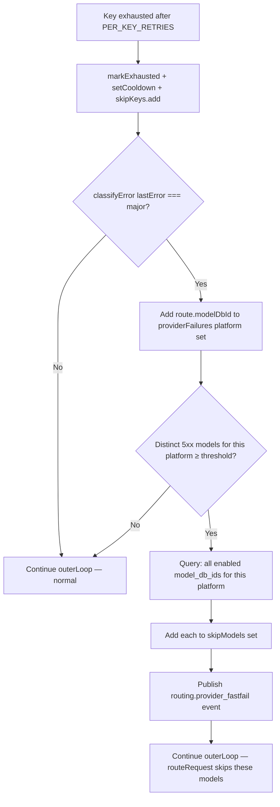

# Provider-Outage Fast-Fail — Design Document

## 1. Architecture Overview

Provider-outage fast-fail slots into the existing proxy retry loop at a single seam: the **key-exhaustion handler**. Today, when a key exhausts its retries, the proxy marks it, adds a cooldown, and continues the outer loop. The fast-fail adds one extra check after that block: when the exhaustion was caused by a 5xx error on a platform that has already seen a 5xx on a *different* model, add every model from that platform to `skipModels`.



**The rest of the pipeline doesn't change.** `routeRequest()`, `orderChain()`, rate limiting, degradation, key selection — they all already honour `skipModels`. The fast-fail simply populates `skipModels` earlier and more broadly than the existing 404/403 path does.

---

## 2. Core Data Model

### 2.1 Tracking Structure (request-scoped)

```typescript
// Declared inside the retry loop in proxy.ts, NOT at module level
const providerFailures = new Map<string, Set<number>>();
//   key:   platform slug  (e.g. "bluesminds")
//   value: set of modelDbIds that 5xx'd on this platform in THIS request
```

This is a local variable in the handler function. It is created per-request, lives for the duration of the retry loop, and is garbage-collected when the request completes. No persistence, no startup hydration, no shutdown flush.

### 2.2 Configuration

```typescript
// Module-level constant in proxy.ts
const PROVIDER_FASTFAIL_THRESHOLD = parseInt(process.env.PROVIDER_FASTFAIL_THRESHOLD ?? '2', 10);
```

| Value | Behaviour |
|---|---|
| `0` | Feature disabled — no fast-fail, identical to current behaviour |
| `1` | Aggressive — first 5xx on any model from a provider skips all models (not recommended; a single model's 503 could be transient) |
| `2` | Default — two distinct models from the same provider must 5xx before skip |
| `N` | N distinct models must 5xx before the provider is skipped |

### 2.3 Event Shape

```typescript
// Added to the LiveEvent union in server/src/services/events.ts
| { type: 'routing.provider_fastfail'; id: string; provider: string; failedModelCount: number; at: number }
```

---

## 3. Algorithm Details

### 3.1 Fast-Fail Check (inserted after key-exhaustion block)

**Location in proxy.ts**: After the existing `publish({ type: 'routing.key_exhausted', ... })` call (~L1242), before the `continue outerLoop` that closes the outer `for` loop.

```typescript
// ── Provider-outage fast-fail ──────────────────────────────
// When ≥PROVIDER_FASTFAIL_THRESHOLD distinct models on the same
// platform have returned a 5xx (major) error in this request,
// the provider is considered down — skip every remaining model
// from that platform for the rest of this request.
if (PROVIDER_FASTFAIL_THRESHOLD > 0 && classifyError(lastError) === 'major') {
  const failed = providerFailures.get(route.platform) ?? new Set<number>();
  failed.add(route.modelDbId);
  providerFailures.set(route.platform, failed);

  if (failed.size >= PROVIDER_FASTFAIL_THRESHOLD) {
    // Only emit the event and query once — guard against re-trigger
    // on subsequent key exhaustions from the same provider.
    if (!providerFailures.has(route.platform + ':fastfired')) {
      providerFailures.set(route.platform + ':fastfired', new Set());

      const platformModels = db.prepare(
        'SELECT id FROM models WHERE platform = ? AND enabled = 1'
      ).all(route.platform) as Array<{ id: number }>;
      for (const m of platformModels) skipModels.add(m.id);

      publish({
        type: 'routing.provider_fastfail',
        id: requestId,
        provider: route.platform,
        failedModelCount: failed.size,
        at: Date.now(),
      });
    }
  }
}
```

### 3.2 Guarding Against Duplicate Events

The fast-fail check runs on *every* key exhaustion. After the threshold is crossed, subsequent key exhaustions on the same provider would re-trigger the `if (failed.size >= threshold)` block. To prevent:

- Duplicate `routing.provider_fastfail` events
- Redundant `SELECT id FROM models` queries

We use a sentinel key in the same map: `platform + ':fastfired'`. Once set, the block is a no-op for that provider for the remainder of the request. This is simpler than a separate `Set<string>` tracking "already fast-failed providers" and avoids an additional allocation.

**Alternative considered**: A separate `fastFiredProviders: Set<string>`. Rejected because it's another local variable for the same information — the sentinel key in the existing map is sufficient and keeps the surface area minimal.

### 3.3 classifyError Reuse

The fast-fail reuses the existing `classifyError()` from `degradation.ts` — no new error classification logic. The function returns `'major'` for 5xx/server errors, `'minor'` for 429/402, and `null` for non-retryable errors. Only `'major'` counts toward the provider-outage threshold.

**Import**: `proxy.ts` already imports `classifyError` indirectly (it's used at L1240 `const lastTier = classifyError(lastError)`). Verify the import is present; add if missing.

---

## 4. Integration Points

### 4.1 Changes to `proxy.ts`

| Location | Change |
|---|---|
| Module-level constants (~L189) | Add `PROVIDER_FASTFAIL_THRESHOLD` env var read |
| Retry loop variable declarations (~L745-749) | Add `const providerFailures = new Map<string, Set<number>>()` after `let prevModelKey` |
| After key-exhaustion publish (~L1242) | Add the fast-fail check block (§3.1 above) |

**Total new code**: ~20 lines. No modifications to the routing, streaming, or response paths.

### 4.2 Changes to `server/src/services/events.ts`

Add one more variant to the `LiveEvent` union type:

```typescript
| { type: 'routing.provider_fastfail'; id: string; provider: string; failedModelCount: number; at: number }
```

### 4.3 Changes to `client/src/components/live-events.tsx`

| Location | Change |
|---|---|
| `LiveEventBase` interface union (~L17) | Add `ProviderFastFailEvent` interface |
| `LiveEvent` type (~L18) | Add union member |
| `formatEvent` switch (~L32-45) | Add case for `'routing.provider_fastfail'` |

```typescript
interface ProviderFastFailEvent extends LiveEventBase {
  type: 'routing.provider_fastfail';
  provider: string;
  failedModelCount: number;
}

// In formatEvent:
case 'routing.provider_fastfail':
  return { id: evt.id, ts, kind: 'warn',
    text: `⚡ [${rId}] Provider ${evt.provider} fast-failed (${evt.failedModelCount} models down) — skipping remaining models` };
```

### 4.4 Files NOT Changed

- `router.ts` — no changes; `skipModels` already does what we need
- `scoring.ts` — no changes; degradation handles cross-request backoff
- `ratelimit.ts` — no changes; cooldowns are orthogonal
- `key-exhaustion.ts` — no changes; per-key tracking is orthogonal
- `degradation.ts` — no changes; `classifyError` is reused as-is

---

## 5. Worked Example — Observed Incident

**Setup**: Provider "bluesminds" with 2 models (kimi-k2.6 = modelDbId 10, glm-5.1 = modelDbId 20) and 15 keys (#83–#97). All models return 503 "No available channel". No other providers configured. Threshold = 2.

| Step | Action | providerFailures | skipModels | Result |
|---|---|---|---|---|
| 1 | routeRequest → key#83 + kimi-k2.6 → 503 | `{bluesminds: {10}}` | `{}` | size=1 < 2 → normal continue |
| 2 | routeRequest → key#83 + glm-5.1 → 503 | `{bluesminds: {10,20}}` | `{10,20}` | size=2 ≥ 2 → **fast-fail!** All bluesminds models added to skipModels |
| 3 | routeRequest → skipModels={10,20} → no models available | — | — | 429 "All models exhausted" |

**Before**: 30 retry attempts (15 keys × 2 models)  
**After**: 2 attempts → immediate 429  
**Reduction**: ~93% fewer wasted attempts

---

## 6. Edge Cases

### 6.1 Provider with Only One Model

Provider "acme" has 1 model. After 3 retries, key exhausted, `providerFailures["acme"] = {modelId}` (size=1). 1 < 2 → fast-fail never triggers. Normal retry exhaustion continues. **Correct**: a single model's 503 might be transient.

### 6.2 Mixed Errors (429 + 503)

Model A on provider "x" returns 429 (classify → `'minor'`, does NOT count). Model B on provider "x" returns 503 (classify → `'major'`, counts). `providerFailures["x"] = {B}` (size=1). Threshold not met. **Correct**: 429 is not a provider-outage signal.

### 6.3 Provider Recovers Mid-Request

Fast-fail is scoped to one request. The next request starts with `providerFailures = new Map()`. If the provider has recovered, it routes normally. **Correct**: no lasting penalty from the fast-fail.

### 6.4 skipModels Already Contains Some Models

`skipModels = {10}` (from a 404 earlier). Fast-fail queries all models for the platform → `{10, 20}`. Adds both to `skipModels` (Set.add is idempotent). Result: `skipModels = {10, 20}`. **Correct**: set union semantics.

### 6.5 Multiple Providers Simultaneously Down

Provider A and Provider B both experience outages. Each triggers independently when its own threshold is crossed. Models from provider C (healthy) are still routed normally. **Correct**: per-provider isolation.

### 6.6 Threshold = 1 (Aggressive)

A single 503 on any model from a provider skips ALL models from that provider. This is available for operators who want maximum failover speed and are willing to accept false positives. **Documented risk**: a single model's transient 503 will skip healthy sibling models.

### 6.7 Threshold = 0 (Disabled)

`if (PROVIDER_FASTFAIL_THRESHOLD > 0)` short-circuits — the inner block never executes. Behaviour identical to today. **Correct**: feature is cleanly disabled.

### 6.8 Pinned Model on Fast-Failed Provider

Pinned to model on provider "x". After fast-fail, model is in `skipModels`. `routeRequest` sees the preferred modelDbId in `skipModels`, skips it, sees `pinMode=true`, throws `PINNED_MODEL_EXHAUSTED`. Existing catch returns 429 to client. **Correct**: immediate error, no wasted retries.

---

## 7. Testing Strategy

### 7.1 Unit Tests (`routing-provider-fastfail.test.ts`)

| Test Case | Setup | Assertion |
|---|---|---|
| Single-model provider 503 doesn't fast-fail | 1 provider, 1 model, 3 keys; all return 503 | SkipModels stays empty after first key exhaustion |
| Two-model provider 503 triggers fast-fail | 1 provider, 2 models, 3 keys; first key on each model 503s | All provider's model IDs in skipModels |
| Mixed 429+503 doesn't trigger | 1 provider, 2 models; model A 429s, model B 503s | Only 1 count → no fast-fail |
| Event emitted exactly once | Same as two-model test | One `routing.provider_fastfail` event; not two |
| Second provider still routes | Provider A fast-fails, Provider B healthy | Routes to Provider B |
| Threshold=0 disables feature | Env var = 0, same as two-model test | No fast-fail, no event, skipModels empty |
| Pinned model immediate error | Pinned to fast-failed provider model | 429 `PINNED_MODEL_EXHAUSTED` |

### 7.2 Integration Considerations

The fast-fail only touches the proxy layer (not the router), so existing router tests (`routing-exhaustion.test.ts`, `router-bandit.test.ts`) are unaffected. New tests mock provider calls at the proxy level, similar to the existing exhaustion test pattern.
