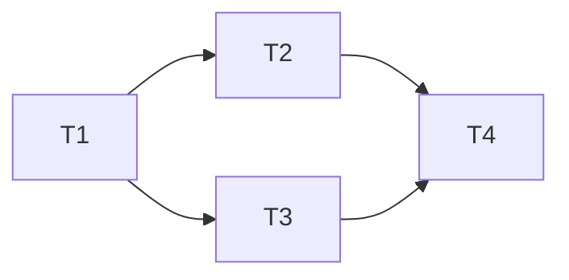

# Provider-Outage Fast-Fail — Implementation Tasks

### Dependency Graph



Tasks 2 and 3 can run in parallel after Task 1. Task 4 (verification) depends on both.

---

## Task 1: Server — Add fast-fail logic to `proxy.ts`

### What to build

Insert the provider-outage detection and skip logic into the existing retry loop in the chat-completions handler.

### Exact changes

**1a.** Module-level constant (after `PER_KEY_RETRIES` ~L189):

```typescript
const PROVIDER_FASTFAIL_THRESHOLD = parseInt(process.env.PROVIDER_FASTFAIL_THRESHOLD ?? '2', 10);
```

**1b.** Retry-loop local variable (after `let prevModelKey` ~L749):

```typescript
const providerFailures = new Map<string, Set<number>>();
```

**1c.** Fast-fail check block (after the `publish({ type: 'routing.key_exhausted', ... })` call ~L1242, before the implicit `continue outerLoop`):

```typescript
// ── Provider-outage fast-fail ──────────────────────────────
if (PROVIDER_FASTFAIL_THRESHOLD > 0 && classifyError(lastError) === 'major') {
  const failed = providerFailures.get(route.platform) ?? new Set<number>();
  failed.add(route.modelDbId);
  providerFailures.set(route.platform, failed);

  if (failed.size >= PROVIDER_FASTFAIL_THRESHOLD) {
    if (!providerFailures.has(route.platform + ':fastfired')) {
      providerFailures.set(route.platform + ':fastfired', new Set());

      const platformModels = db.prepare(
        'SELECT id FROM models WHERE platform = ? AND enabled = 1'
      ).all(route.platform) as Array<{ id: number }>;
      for (const m of platformModels) skipModels.add(m.id);

      publish({
        type: 'routing.provider_fastfail',
        id: requestId,
        provider: route.platform,
        failedModelCount: failed.size,
        at: Date.now(),
      });
    }
  }
}
```

### Verify import

`classifyError` must be importable from `degradation.ts`. Check the existing imports at the top of `proxy.ts` — if `classifyError` is not imported, add:

```typescript
import { classifyError } from '../services/degradation.js';
```

### Critical invariants

- `providerFailures` is a **local variable** inside the handler, NOT module-level
- The sentinel key (`route.platform + ':fastfired'`) prevents duplicate events + duplicate DB queries
- `classifyError(lastError)` returns `'major'` for 5xx, `'minor'` for 429/402, `null` for non-retryable — only `'major'` counts
- The DB query (`SELECT id FROM models WHERE platform = ? AND enabled = 1`) uses `db` which is already in scope in the handler (it was fetched at ~L703)
- The `skipModels` set already exists in the handler scope at ~L746
- `PROVIDER_FASTFAIL_THRESHOLD = 0` short-circuits the entire block — feature is cleanly disabled

---

## Task 2: Server — Add event type to `events.ts`

### What to build

Add the `routing.provider_fastfail` variant to the `LiveEvent` union type.

### Exact changes

In `server/src/services/events.ts`, find the `LiveEvent` union type (~L12-19) and add one more variant:

```typescript
| { type: 'routing.provider_fastfail'; id: string; provider: string; failedModelCount: number; at: number }
```

### What NOT to change

- `publish()` function — no changes needed
- `subscribeSse()` — no changes needed
- The event bus infrastructure — no changes needed

---

## Task 3: Client — Add dashboard rendering to `live-events.tsx`

### What to build

Add the `ProviderFastFailEvent` interface and rendering case for `routing.provider_fastfail`.

### Exact changes

**3a.** Add interface (after `ModelSwitchEvent` ~L16):

```typescript
interface ProviderFastFailEvent extends LiveEventBase { type: 'routing.provider_fastfail'; provider: string; failedModelCount: number; }
```

**3b.** Add to `LiveEvent` union (~L18):

```typescript
type LiveEvent = RequestStartEvent | RequestDoneEvent | RequestErrorEvent | KeyExhaustedEvent | KeyRetryEvent | ModelSwitchEvent | ProviderFastFailEvent;
```

**3c.** Add case to `formatEvent` switch (before the closing brace ~L45):

```typescript
case 'routing.provider_fastfail':
  return { id: evt.id, ts, kind: 'warn' as const,
    text: `⚡ [${rId}] Provider ${evt.provider} fast-failed (${evt.failedModelCount} models down) — skipping remaining models` };
```

### Critical invariants

- `kind: 'warn'` — this is a new kind value. Check that the `LogEntry.kind` type union (~L24: `'start' | 'done' | 'error' | 'info'`) includes `'warn'`. If not, add it.
- The `⚡` prefix makes provider fast-fails visually distinct from info-level key_exhausted and model_switch messages

---

## Task 4: Tests — Add unit tests for provider fast-fail

### What to build

New test file `server/src/__tests__/services/routing-provider-fastfail.test.ts` following the pattern of `routing-exhaustion.test.ts`.

### Test structure

```typescript
import { describe, it, expect, beforeEach, afterEach, vi } from 'vitest';
import * as ratelimit from '../../services/ratelimit.js';
import { classifyError } from '../../services/degradation.js';
import { getDb, initDb } from '../../db/index.js';

vi.mock('../../services/ratelimit.js', async () => {
  const actual = await vi.importActual('../../services/ratelimit.js');
  return {
    ...actual,
    canMakeRequest: vi.fn(),
    canUseTokens: vi.fn(),
    isOnCooldown: vi.fn(() => false),
    canUseProvider: vi.fn(() => true),
  };
});

vi.mock('../../lib/crypto.js', async () => {
  const actual = await vi.importActual('../../lib/crypto.js');
  return {
    ...actual,
    decrypt: vi.fn(() => 'mocked-api-key'),
  };
});
```

### Test cases (minimum set)

#### Group: classifyError integration

| Test | Input | Expected |
|---|---|---|
| 503 is major | `{ message: '503 service unavailable' }` | `'major'` |
| 429 is minor | `{ message: '429 rate limit' }` | `'minor'` |
| 402 is minor | `{ message: '402 payment required' }` | `'minor'` |
| 404 is null | `{ message: '404 not found' }` | `null` |

#### Group: Fast-fail trigger

| Test | Setup | Assertion |
|---|---|---|
| Single-model provider doesn't fast-fail | 1 provider with 1 model, 3 keys; mock all to 503 | `skipModels` empty after first key exhaustion |
| Two-model provider triggers fast-fail | 1 provider with 2 models, 3 keys; first key on each 503s | All models for that platform added to `skipModels` |
| Mixed 429+503 doesn't trigger | 1 provider, 2 models; model A: 429, model B: 503 | Only 1 count → no fast-fail |
| Threshold=0 disables | `PROVIDER_FASTFAIL_THRESHOLD=0`; same as two-model test | No fast-fail, `skipModels` empty |

#### Group: Event emission

| Test | Assertion |
|---|---|
| Event emitted on fast-fail | `publish` called with `type: 'routing.provider_fastfail'` |
| Event emitted exactly once per provider | Two key exhaustions after threshold → only one event |

#### Group: Multi-provider failover

| Test | Setup | Assertion |
|---|---|---|
| Healthy provider still routes | Provider A fast-fails; Provider B has a healthy model | Request routes to Provider B |

### Critical invariants

- The test file must NOT modify `proxy.ts` or `router.ts` — it tests the routing layer's `skipModels` behaviour directly via `routeRequest()`, not the full HTTP handler
- Mock `canMakeRequest` to return `false` for exhausted keys, `true` for functional keys
- The `classifyError` tests confirm the error-classification contract the fast-fail depends on
- Tests must clean up env vars in `afterEach`

---

## Task 5: Run existing test suite to verify no regressions

### What to do

After Tasks 1-4 are complete, run:

```bash
npm run test -w server
```

Verify:
- All existing tests pass (especially `routing-exhaustion.test.ts` and `router-bandit.test.ts`)
- New test file passes
- Client typecheck passes (`npm run test -w client` or equivalent)

### Expected failures

None — the fast-fail is purely additive. No existing behaviour is modified. If any test breaks, it indicates an integration issue in the implementation.
